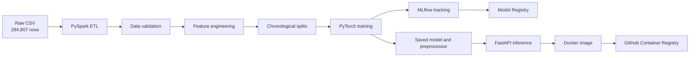

# Production Fraud Detection ML Pipeline

An end-to-end fraud-classification system built with PySpark, PyTorch, MLflow, FastAPI, Docker, and GitHub Actions. The project processes 284K+ credit-card transactions through validation, feature engineering, chronological splitting, model training, evaluation, registry versioning, batch prediction, and low-latency online inference.

## Architecture



## Features

- Explicit PySpark schema and CSV-header validation
- Null, target, amount, and duplicate validation
- `AmountLog` and transaction-hour feature engineering
- Chronological 70/15/15 train, validation, and test splits
- Class-weighted PyTorch binary classifier
- Early stopping using validation PR-AUC
- Validation-based decision-threshold selection
- ROC-AUC, PR-AUC, precision, recall, and F1 evaluation
- MLflow experiment tracking and registered-model versioning
- Standalone saved-model evaluation
- Vectorized batch prediction
- FastAPI health, readiness, and prediction endpoints
- Privacy-safe structured prediction monitoring
- Dockerized inference service
- Automated linting, testing, vulnerability scanning, image building, and container publishing
- Pandas/PySpark preprocessing and API-latency benchmarks

## Dataset

The project uses the public Credit Card Fraud Detection dataset containing European cardholder transactions from September 2013.

Place the downloaded file at:

```text
data/raw/creditcard.csv
```

The raw dataset and generated processed files are excluded from Git.

### Processed splits

| Split | Rows | Fraud cases | Time range |
|---|---:|---:|---:|
| Train | 198,420 | 366 | 0–132,822 |
| Validation | 42,498 | 55 | 132,823–151,199 |
| Test | 42,808 | 52 | 151,200–172,792 |
| Total after deduplication | 283,726 | 473 | 0–172,792 |

Chronological splitting is used instead of random splitting to better represent evaluation on future transactions.

## Model results

The selected probability threshold is `0.95`.

| Metric | Validation | Test |
|---|---:|---:|
| ROC-AUC | 0.9804 | 0.9749 |
| PR-AUC | 0.8625 | 0.7710 |
| Precision | 0.7015 | 0.6610 |
| Recall | 0.8545 | 0.7500 |
| F1 | 0.7705 | 0.7027 |

PR-AUC is emphasized because fraud detection is highly imbalanced and ROC-AUC alone can hide weak minority-class performance.

## Inference benchmarks

Benchmarks used 20 warm-up requests followed by 200 sequential measured requests on the development machine.

| Environment | Mean latency | P95 latency | P99 latency | Throughput |
|---|---:|---:|---:|---:|
| Local Uvicorn | 2.52 ms | 3.29 ms | 4.15 ms | 396.6 requests/s |
| Dockerized API | 3.50 ms | 4.22 ms | 4.63 ms | 285.3 requests/s |

Both environments passed the sub-100 ms P95 latency target.

These are warmed localhost measurements, not distributed production load-test results.

## Preprocessing benchmark

| Pipeline | End-to-end time |
|---|---:|
| Pandas reference | 3.72 seconds |
| Dockerized PySpark | 41.01 seconds |

The measurements are not an equal speed comparison. The Pandas baseline writes one transformed dataset, while PySpark also validates, performs chronological splitting, and writes three datasets. The Spark measurement includes Docker and JVM startup.

For this 284K-row local workload, Pandas is faster. PySpark is included to demonstrate distributed ETL design and becomes more appropriate as data volume and cluster parallelism increase.

## Requirements

- Python 3.11 or 3.12
- Java 17
- Git
- Docker Desktop with WSL2 on Windows

## Local setup

From PowerShell:

```powershell
cd "C:\path\to\Fraud Detection Pipeline"

python -m venv .venv
.\.venv\Scripts\Activate.ps1

python -m pip install --upgrade pip
python -m pip install -e ".[dev]"
```

Verify the environment:

```powershell
python --version
java -version
docker version
```

## Run PySpark ETL

The Dockerized Spark workflow avoids platform-specific Hadoop write issues on Windows:

```powershell
docker run --rm `
  --mount "type=bind,source=$($PWD.Path),target=/workspace" `
  --workdir /workspace `
  apache/spark:4.2.0-python3 `
  /opt/spark/bin/spark-submit `
  src/data/spark_etl.py
```

Generated splits are written to:

```text
data/processed/spark/train.parquet
data/processed/spark/validation.parquet
data/processed/spark/test.parquet
```

## Start MLflow

```powershell
mlflow server `
  --host 127.0.0.1 `
  --port 5000 `
  --backend-store-uri sqlite:///mlflow.db `
  --default-artifact-root ./mlartifacts
```

Open the MLflow interface at:

```text
http://127.0.0.1:5000
```

MLflow data, its SQLite database, and generated artifacts are excluded from Git.

## Train and register the model

Keep MLflow running, then use a second terminal:

```powershell
.\.venv\Scripts\Activate.ps1
python -m src.models.train
```

Training:

1. Loads the chronological Parquet splits.
2. Fits the scaler using training data only.
3. Trains with class-weighted binary cross-entropy.
4. Applies early stopping based on validation PR-AUC.
5. Selects the validation threshold that maximizes F1.
6. Evaluates once on the test split.
7. Logs parameters, metrics, and artifacts to MLflow.
8. Registers a numbered model version.
9. Synchronizes the local preprocessor metadata with that registry version.

Local runtime artifacts are written to:

```text
artifacts/model.pt
artifacts/preprocessor.json
artifacts/metrics.json
```

## Evaluate saved artifacts

Evaluate the saved model without retraining:

```powershell
python -m src.models.evaluate
```

The report is written to:

```text
artifacts/evaluation_report.json
```

## Run batch prediction

Score the complete raw CSV:

```powershell
python -m src.models.predict
```

Predictions are written to:

```text
artifacts/batch_predictions.csv
```

The output includes transaction index, fraud probability, predicted class, threshold, and model version. Raw feature values are not copied into the prediction output.

## Run the API

```powershell
python -m uvicorn src.api.main:app --host 127.0.0.1 --port 8000
```

Endpoints:

| Endpoint | Purpose |
|---|---|
| `GET /health` | Confirms that the web application is running |
| `GET /ready` | Confirms that model artifacts loaded successfully |
| `POST /predict` | Scores one transaction |
| `GET /docs` | Opens interactive Swagger documentation |

Swagger UI:

```text
http://127.0.0.1:8000/docs
```

Successful predictions emit privacy-safe JSON logs containing timestamp, latency, probability, predicted class, and model version. Raw transaction features are not logged.

## Run the Dockerized API

Build the image:

```powershell
docker build -t fraud-detection-api .
```

Run it with model artifacts mounted read-only:

```powershell
docker run --rm `
  --name fraud-detection-api `
  -p 8000:8000 `
  --mount "type=bind,source=$($PWD.Path)\artifacts,target=/app/artifacts,readonly" `
  fraud-detection-api
```

Verify readiness:

```powershell
Invoke-RestMethod http://127.0.0.1:8000/ready
```

The model is mounted separately so generated model artifacts are not embedded in Git history or the source image.

## Run benchmarks

Preprocessing:

```powershell
python .\benchmarks\preprocessing.py
```

Inference, with the API already running:

```powershell
python .\benchmarks\inference.py
```

Docker-labeled inference benchmark:

```powershell
$env:BENCHMARK_ENVIRONMENT = "docker"
python .\benchmarks\inference.py
Remove-Item Env:BENCHMARK_ENVIRONMENT
```

## Quality and security checks

```powershell
python -m ruff check .
python -m pytest
python -m pip_audit --ignore-vuln PYSEC-2026-3552
```

The audit exception is temporary and narrowly scoped. MLflow 3.15.1 requires `cryptography<50`, while the advisory is fixed in version 50. The exception should be removed when MLflow supports the corrected dependency.

## CI/CD

GitHub Actions runs the following for every push and pull request to `main`:

1. Installs Python and Java.
2. Installs project dependencies.
3. Audits Python dependencies.
4. Runs Ruff.
5. Runs the automated test suite.
6. Validates the Docker build.

After a successful push to `main`, a second job:

1. Builds the container using Docker Buildx.
2. Tags it with `latest` and the Git commit SHA.
3. Publishes it to GitHub Container Registry.

This provides automated continuous integration and container delivery. Deployment to a live cloud runtime would require a separate hosting target and credentials.

## Project structure

```text
fraud-detection/
├── data/
│   ├── raw/
│   └── processed/
├── src/
│   ├── api/
│   ├── data/
│   ├── features/
│   └── models/
├── tests/
├── benchmarks/
├── configs/
├── artifacts/
├── notebooks/
├── .github/workflows/
├── Dockerfile
├── docker-compose.yml
├── pyproject.toml
└── README.md
```

## Limitations

- The dataset is historical, anonymized, and extremely imbalanced.
- The current test F1 is 0.7027, not 0.80+.
- Benchmarks were collected on one local development machine.
- Sequential latency does not represent maximum concurrent production load.
- PySpark has significant startup overhead at this dataset size.
- No live cloud deployment or automated retraining schedule is included.
- Fraud predictions should support human review rather than automatically blocking financial activity.

## Future improvements

- Tune network architecture and class-imbalance handling.
- Compare focal loss and sampling strategies.
- Add concurrent load testing.
- Add feature-distribution and concept-drift alerts.
- Deploy the container to a managed cloud or Kubernetes service.
- Add scheduled retraining with approval-based model promotion.